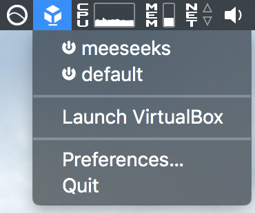
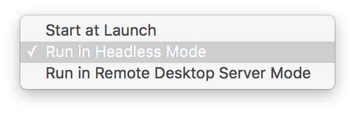
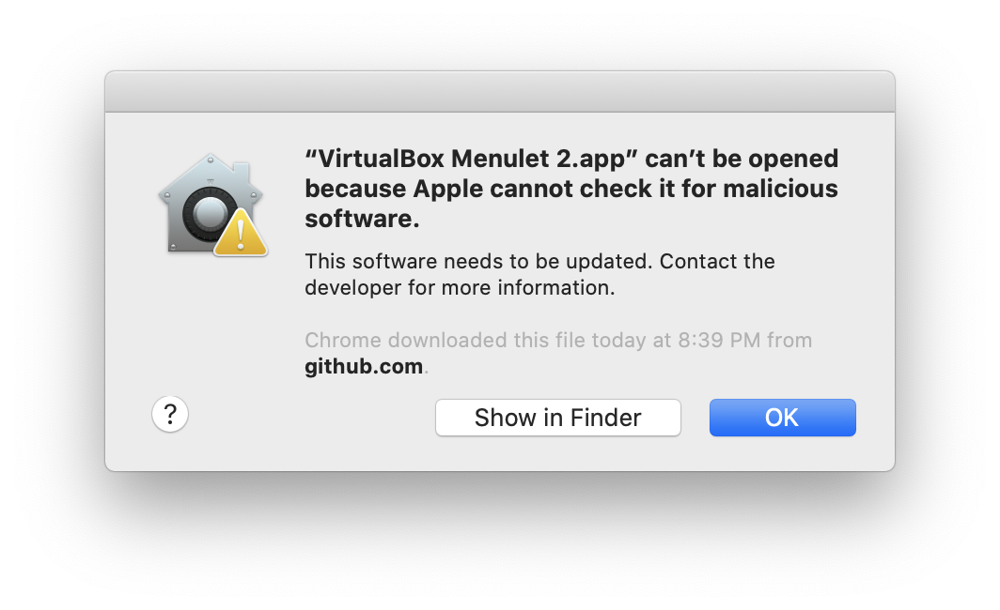

# vbox-osx-menubar

This is a clone of the [statusmenus][0] project hosted on SourceForge.

It has only a couple of patches (see commits) to remove the shadows and switch
to light icons for the dark menubar in OSX 10.10.

You can configure VMs to run in headless mode from the sub-menu:

[0]: https://sourceforge.net/projects/statusmenus/

## aidandj updates

* Update for MacOS 10.15
* Remove optimization (couldn't find file)
* Release a binary
* Add license

## Error on opening

There is a good chance you will get an error like the one below

To bypass this, hold <kbd>⌃ Control</kbd> and click on the `VirtualBox Menulet.app` item. Then select `Open`, and the click `Open` again in the file dialog.